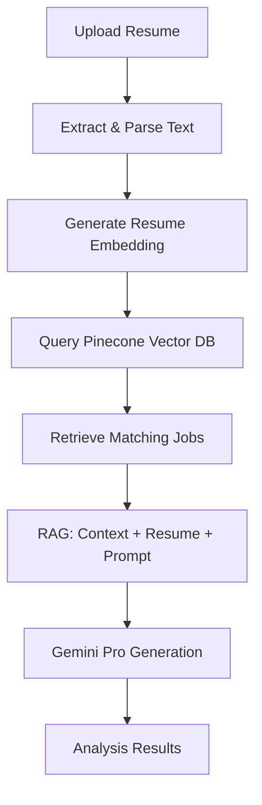

# 📋 Resume Analyzer & Job Matcher

A powerful AI-driven application that analyzes resumes and matches them with relevant job opportunities using **RAG (Retrieval-Augmented Generation)** technology, powered by **Gemini API** and **Pinecone vector database**.

## 🚀 Features

- **📤 Resume Upload**: Support for PDF, DOCX, and TXT formats
- **🧠 AI-Powered Analysis**: Uses Gemini Pro for intelligent resume parsing and analysis
- **🔍 Semantic Job Matching**: Vector-based job matching using Gemini embeddings and Pinecone
- **📊 Comprehensive Reports**: Generate candidate summaries, interview questions, and cover letters
- **📈 Skill Gap Analysis**: Identify areas for improvement and career development
- **📝 Personalized Cover Letters**: AI-generated, tailored cover letters for each job match
- **💾 Export Functionality**: Download analysis reports and cover letters

## 🛠️ Tech Stack

- **Frontend**: Streamlit
- **Backend**: Python
- **LLM**: Google Gemini Pro API
- **Embeddings**: Gemini Embedding Model (`embedding-001`)
- **Vector Database**: Pinecone
- **Document Processing**: PyPDF2, python-docx

## 📊 How It Works

### 1. RAG Pipeline Architecture



### 2. Document Processing
- **PDF**: PyPDF2 for text extraction
- **DOCX**: python-docx for Word documents
- **TXT**: Direct text processing
- **Parsing**: Regex-based section identification (skills, experience, education)

### 3. Vector Search
- Resume text → Gemini embeddings (768 dimensions)
- Semantic similarity search in Pinecone
- Top-K job retrieval based on cosine similarity

### 4. RAG Generation
- Retrieved job descriptions as context
- Structured prompts for specific outputs
- Gemini Pro for coherent, contextual generation

## 📋 Usage Guide

1. **Launch the app**: Navigate to the Streamlit interface
2. **Upload resume**: Click "Choose your resume file" and select PDF/DOCX/TXT
3. **Process**: Click "Process Resume" to start analysis
4. **Review results**: 
   - View job matches ranked by similarity
   - Read AI-generated candidate summary
   - Review technical interview questions
   - Access personalized cover letter
   - Check skill gap analysis
5. **Export**: Download full report or individual sections

## 🔧 Customization

### Adding More Jobs
Edit `job_data_uploader.py` to add your job descriptions:

```python
SAMPLE_JOBS = [
    {
        "id": "job_new",
        "title": "Your Job Title",
        "company": "Company Name",
        "description": "Job description here..."
    },
    # Add more jobs...
]
```
## 🧪 Advanced Features

### Custom Job Database
Replace sample jobs with your own database:

1. Prepare job data in JSON/CSV format
2. Modify `job_data_uploader.py` to read your data
3. Run the uploader to populate Pinecone

### Integration with Job APIs
Connect to live job boards:

```python
# Example: LinkedIn, Indeed, etc.
def fetch_jobs_from_api():
    # Your API integration code
    pass
```

### Resume Storage
Add database integration for resume history:

```python
# Example: SQLite, PostgreSQL, MongoDB
def save_resume_analysis():
    # Store analysis results
    pass
```

## 🐛 Troubleshooting

### Common Issues

1. **Environment Variables**:
   ```bash
   # Check if .env is loaded
   python -c "from dotenv import load_dotenv; load_dotenv(); import os; print(os.getenv('GEMINI_API_KEY'))"
   ```

2. **Pinecone Connection**:
   - Verify API key and environment in Pinecone console
   - Check index name matches your configuration

3. **File Upload Issues**:
   - Ensure file size < 200MB
   - Check file format (PDF/DOCX/TXT only)
   - Try converting PDF to text format if extraction fails

4. **API Rate Limits**:
   - Gemini API has rate limits - add delays if needed
   - Pinecone has operation limits on free tier

### Debug Mode
Enable debug logging:

```python
import logging
logging.basicConfig(level=logging.DEBUG)
```

## 📈 Performance Tips

1. **Optimize Embeddings**: Batch embedding generation for multiple resumes
2. **Cache Results**: Store embeddings to avoid regeneration
3. **Async Processing**: Use async calls for better performance
4. **Index Optimization**: Use appropriate Pinecone pod types for your scale

## 📄 License

This project is licensed under the MIT License - see the LICENSE file for details.

## 🙏 Acknowledgments

- **Google Gemini** for powerful LLM and embedding capabilities
- **Pinecone** for efficient vector database operations
- **Streamlit** for rapid web app development
- **Open source community** for various document processing libraries

## 📞 Support

For issues, questions, or contributions:

1. **GitHub Issues**: Create an issue for bugs or feature requests
2. **Documentation**: Check this README and code comments
3. **Community**: Join discussions in the repository

---

**Built with ❤️ using AI and modern vector search technology**
